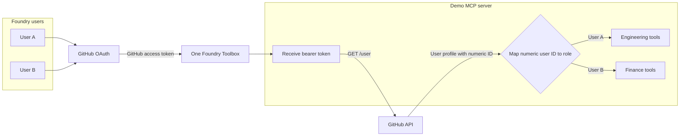

# GitHub OAuth user-scoped MCP demo

This demo proves that the **same Foundry Toolbox and MCP server** can return
different tools for different signed-in GitHub users.

## 1. Demo configuration



The MCP calls `https://api.github.com/user`, maps the immutable numeric GitHub
user ID to a role, and filters both `tools/list` and `tools/call`. OAuth scopes
are not used to select the role or tool catalog.

| User | Role-specific tools |
|---|---|
| User A / Engineering | `search_service_incidents`, `get_deployment_status`, `create_incident_mitigation_plan` |
| User B / Finance | `search_budget_variances`, `get_cost_center_status`, `create_spend_mitigation_plan` |
| Unconfigured user | Only `get_current_user` |

## 2. Build and deploy the demo MCP

```powershell
git clone https://github.com/shpengmsft/foundry-toolbox-user-scoped-mcp-demo.git
cd foundry-toolbox-user-scoped-mcp-demo

python -m venv .venv
.\.venv\Scripts\python -m pip install -e ".[dev]"
.\.venv\Scripts\python -m pytest -q
```

Find both GitHub numeric user IDs:

```powershell
Invoke-RestMethod "https://api.github.com/users/<user-a-login>" |
  Select-Object id, login
Invoke-RestMethod "https://api.github.com/users/<user-b-login>" |
  Select-Object id, login
```

Deploy:

```powershell
.\scripts\deploy-container-app.ps1 `
  -ResourceGroup "rg-shpeng-sc" `
  -Location "swedencentral" `
  -ContainerAppName "shpeng-user-scoped-mcp-demo" `
  -AuthMode github `
  -EngineerUserObjectIds "<user-a-github-numeric-id>" `
  -FinanceUserObjectIds "<user-b-github-numeric-id>" `
  -RegistryName "ca6ef7d870dbacr" `
  -ContainerAppsEnvironment "mcpdiag-shpeng-aca-env" `
  -ImageTag "github-oauth-demo"
```

MCP URL:

```text
https://shpeng-user-scoped-mcp-demo.thankfuldune-62c51cc5.swedencentral.azurecontainerapps.io/mcp
```

## 3. Create the GitHub OAuth App

1. Open GitHub **Settings → Developer settings → OAuth Apps**.
2. Select **New OAuth App**.
3. Set the application name to `Foundry user-scoped MCP demo`.
4. Set the homepage URL to the Container App HTTPS origin.
5. Use `https://example.com/callback` as the temporary callback.
6. Register the app.
7. Copy the **Client ID**.
8. Generate and copy the **Client secret**.

Store the secret only in the Foundry connection.

## 4. Create the Foundry project connection

Create an **OAuth passthrough** connection:

| Field | Value |
|---|---|
| MCP URL | Demo MCP URL above |
| Client ID | GitHub OAuth App client ID |
| Client secret | GitHub OAuth App client secret |
| Authorization URL | `https://github.com/login/oauth/authorize` |
| Token URL | `https://github.com/login/oauth/access_token` |
| Refresh URL | `https://github.com/login/oauth/access_token` |
| Scope | `repo` |

Save it and copy the redirect URL generated by Foundry.

If connection creation returns
`ConnectorNamespaceCustomConnectorDirectInvokeRequiresApiDefinitionV3`, use a
region that does not yet contain that Connector Gateway build.

## 5. Update the GitHub OAuth App callback

Open the GitHub OAuth App and replace the temporary callback with the exact
Foundry redirect URL. Preserve its path, case, and trailing slash.

## 6. Create the Toolbox

1. Create one Toolbox.
2. Add an MCP tool.
3. Select the OAuth connection.
4. Use the demo MCP URL.
5. Publish one Toolbox version.
6. Attach that version to the agent.

Use the same Toolbox version for both users.

## 7. Test User A

Use a browser profile signed in to Foundry as User A and GitHub as the account
mapped to Engineering.

System prompt:

```text
Use the available Toolbox tools to investigate the user's current team risk.
Always use the role-specific search tool first. If a risk is found, use the
matching mitigation-plan tool. Do not invent tool results.
```

User query:

```text
Investigate the largest current risk for my team and prepare a mitigation plan.
```

Expected calls:

```text
search_service_incidents
create_incident_mitigation_plan
```

## 8. Test User B

Use a separate browser profile signed in to Foundry as User B and GitHub as the
account mapped to Finance. Use the same system prompt and user query.

Expected calls:

```text
search_budget_variances
create_spend_mitigation_plan
```

## 9. Verify that each user received different tools

In each session ask:

```text
Call get_current_user. Show my user ID and role, then list the names of the
tools currently available to you.
```

Expected comparison:

| Check | User A | User B |
|---|---|---|
| Role | Engineering | Finance |
| Search tool | `search_service_incidents` | `search_budget_variances` |
| Plan tool | `create_incident_mitigation_plan` | `create_spend_mitigation_plan` |

Both traces should contain `external.mcp.tools/list`, followed by different
role-specific `external.mcp.tools/call` operations while using the same MCP
URL, connection, and Toolbox version.
